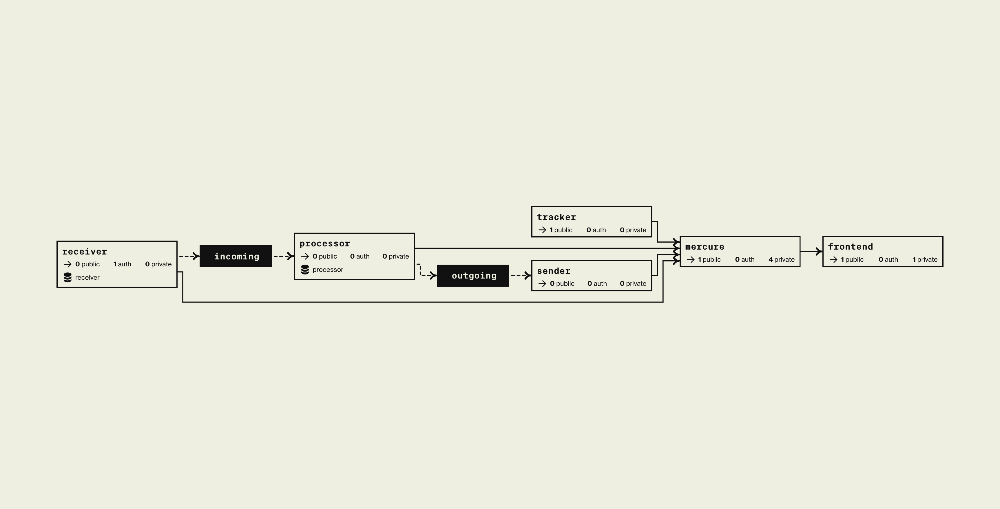

# tractore

An [Encore](https://encore.dev/) application showcasing a  (self-hosted) transactional email tracking use case.

## Description 

Tractore is a POC transactional email tracking application built on [Encore](https://encore.dev/). 

Emails sent to Tractore are processed by including a tracking pixel at the end of its HTML body. 
They're then forwarded to Mailgun for email delivery. 
When an email is viewed in an email client that supports HTML markup, the image is downloaded from Tractore, and the email is then marked as having been opened.

Emails can be submitted through an API, with the `cmd/smtpd/smtpd.go` program providing a convenient relay between the SMTP protocol and the REST API. 
Email clients must be configured to use the local relay.
For testing purposes, any email address can be used as the sender, and the email address to send to must be approved in Mailgun.

In this POC I've implemented [Mercure](https://mercure.rocks/) and [Extism](https://extism.org/) for some additional functionality on top of all the goodies [Encore](https://encore.dev/) already provides. Mercure provides a realtime protocol for updating web UI clients, which is used to inform the frontend of changes to emails.
Extism provides application customization and extension through executing WebAssembly modules.

This project currently primarily serves as a personal learning project to get to know Encore and to evaluate if it's something I'll be using in the future.
It'll probably continue to do so for the foreseaable time. 
If there's things I've stated about Encore but that can be done, let me know, and I'll fix it :-)


TODO: description/screenshot of frontend?



## Run

```console
encore run
```

Run the local SMTP server responsible for forwarding email to the Tractore API.

```console
go run cmd/smtpd/smtpd.go
```

## Technology

* [Encore](https://encore.dev/) as the main framework for the application. 
    * Notable functionalities in use: API definitions and errors, database, client generation through `encore gen client`, pub/sub (for processing and sending email), and secrets.
* [Ent](https://entgo.io/) as the database access layer.
    * With custom [transactional outbox](https://encore.dev/docs/primitives/pubsub/outbox) implementation using Ent models.
* [Extism](https://extism.org/) for WebAssembly plugin functionality.
    * The `cmd/trackembed` directory contains the source code for a Wasm module exposing a function that embeds a tracking pixel in an outgoing email. It is embedded at compile time by being read (after having been compiled) from `pkg/wasm/modules/embed.wasm`.
* [Mercure](https://mercure.rocks/) for realtime web UI updates based on [Server-Sent Events](https://developer.mozilla.org/en-US/docs/Web/API/Server-sent_events/Using_server-sent_events).
    * The [Mercure Hub](https://mercure.rocks/docs/getting-started) is embedded within the [Encore](https://encore.dev/) runtime, and uses an internal publisher.
* [Mailgun](https://www.mailgun.com/) integration for email delivery.


## Encore Feature Wish(ful)list

* Accept TCP/UDP connections, instead of having to alway use HTTP
    * The email sending process currently relies on a local daemon that forwards the mail to `tractore`. It would be nice if it could accept emails directly instead of via email. It's probably not the best fit for Encore, though.
* Return binary responses from an Encore API.
    * At the moment no actual tracking pixel is returned, but the behavior is approximated by returning `application/octet-stream` as the content type. It would be nicer if we could return the actual binary response for an image instead. If this is needed, one has to define a raw API endpoint instead.
* Have some way to provide a relationship between services that are not automatically inferred.
    * In this application the `frontend` relies on a public, raw endpoint defined in the `mercure` service. It would be nice if this could be shown in the application dependency diagram. If the relationship can't be inferred automatically, a workaround might be to define it manually.
* Support mTLS authentication, and do something with it in the app?
    * Haven't tried doing this using a raw endpoint yet, so maybe something can already be done, but it'll need some custom logic at least.
* Offer some type of asynchronous job control
    * Early in the POC I tried integrating [River](https://riverqueue.com/) as a job queue (with transactional queueing), but that didn't work because the existing database pool isn't exposed by Encore (just the `db`). It would be nice to have this type of functionality included, given that it's already using PostgreSQL. To get around the blocker I changed the implementation to rely on some custom logic for persisting the message with the entity in the same transaction now, and to rely on the [transactional outbox](https://encore.dev/docs/primitives/pubsub/outbox) strategy while processing and sending emails.
* Access to the `http.Request`, or at least more (metadata) properties from the original request.
    * Concretely, I would've liked to capture the client IP address, so that I could've included a [CrowdSec](https://www.crowdsec.net/) bouncer in the middleware stack.

## Potential Improvements / Additions 

* Improve the CI/CD of the entire project
* Have some better structured scripts / tooling around the code generation, etc.
* Better email state management; it's pretty basic now.
* Nicer frontend; it's hacked together now.
* OIDC login and user management 
    * Currently there's no multitenancy support, and there's support for only a single user and access token. It would be nice to support multiple users with their own credentials.
* Improve authorization implementation
    * The application is currently considered to be used by a single user, so access decisions are not implemented yet.
* Clean shutdown of running service processes?
* Tighter integration with Mailgun through webhooks, API, etc.
    * Downside of this is that this would result in a stronger dependency on Mailgun as the sending service, whereas it would be nicer to keep that flexible
